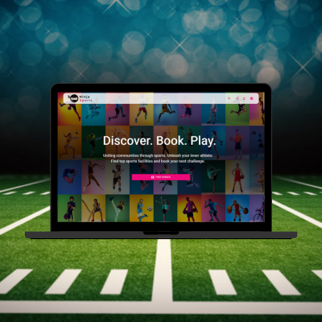

 
# 🥷 Ninja Sports

This is the frontend of an ecommerce created to allow users to buy and sell cars and motorcycles. 

> Check the deployed [app](https://ninjasports.vercel.app/).

💭 Cool features:\
\
:heavy_check_mark: Utilized NextAuth for authentication, integrated with backend requests, and managed user sessions. \
:heavy_check_mark: Integrated Google's address autocomplete to determine time zones, aiding the backend in providing available courts.

## 📋 Instalation guide

- Clone this repo;
- Check the env file for settings up the variables required. (Note that in order to get the application running 2 different google maps api keys are required)
- On the root folder execute `npm run dev`;
- Check the applicaton running on `http://localhost:3000/`

## 💻 Tech stack

     
  

## 💡 Upcoming updates:

- [ ] Backend cart;
- [ ] Auction functionality.
 

## 🔗 Links

- App backend [repo](https://github.com/osmfaria/Mshop-backend);
- [API](https://motors-ecommerce-api.herokuapp.com/) 
- API [documentation](https://motors-ecommerce-api.herokuapp.com/api-docs/) 

## :memo: License

[MIT](./LICENSE)
